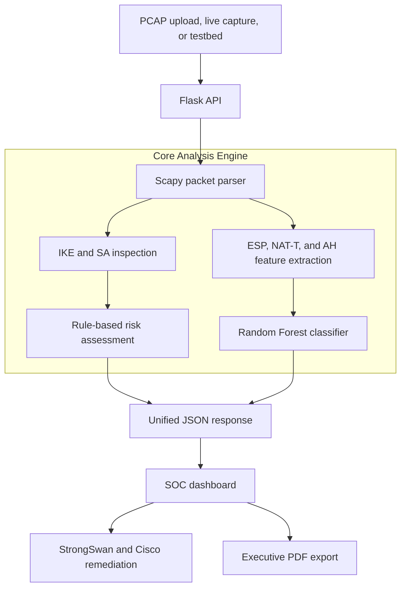

# IPsec Sentinel | Next-Gen Cryptographic Auditor & AI Traffic Inference Engine

> **Smart India Hackathon 2026** | **Problem Statement ID:** `SIH26160`  
> **Domain:** Cybersecurity, AI/ML, and encrypted network forensics  
> **Target:** Local-first web application and live IPsec capture analyzer


## Executive Summary

**IPsec Sentinel** is a local-first security assessment platform for IKEv1, IKEv2, ESP, NAT-T, and AH packet captures. It inspects visible negotiation metadata, evaluates cryptographic posture with transparent rules, classifies encrypted traffic from packet behavior, generates hardened configuration snippets, and exports an executive PDF report without decrypting VPN payloads.

The system is designed for demonstrations, SOC analysis workflows, and security research. Its score is an assessment aid, not a formal compliance certification.

## Key Features

### Cryptographic assessment

- Parses visible IKE proposal metadata for cipher, authentication, DH group, and related security attributes.
- Flags weak choices such as DES, 3DES, MD5, weak DH groups, missing PFS, and AH/NAT compatibility concerns.
- Produces a transparent 0-100 risk score with severity-ranked findings.
- Provides selectable assessment labels for NIST SP 800-77, ANSSI Defense, and FIPS 140-3 in the dashboard.

> The current backend exposes the selected standard to the sample-analysis request, but the audit rules are not yet framework-specific. Add separate rule profiles before treating the three options as independent compliance certifications.

### Offline and live capture analysis

- Drag-and-drop upload for `.pcap` and `.pcapng` files.
- Temporary upload processing with cleanup after analysis.
- Live capture endpoints using Scapy `AsyncSniffer` for UDP 500, UDP 4500, ESP, and AH traffic.
- Built-in weak testbed capture for repeatable demonstrations.

### Encrypted traffic inference

- Uses packet sizes and inter-arrival timing rather than payload decryption.
- Estimates traffic categories such as video, VoIP, web browsing, email/messaging, and ICMP/control traffic.
- Reports an inference confidence value alongside the traffic distribution.

### Remediation and reporting

- Generates hardened StrongSwan and Cisco ASA configuration snippets.
- Exports the visible dashboard as a PDF using `html2pdf.js`.

## Technology Stack

| Layer | Technology | Purpose |
|---|---|---|
| Backend | Python, Flask, Gunicorn | Web server and JSON API |
| Packet inspection | Scapy | PCAP parsing and live capture |
| Numerical processing | NumPy | Traffic feature calculations |
| Classification | scikit-learn Random Forest | Metadata-based traffic inference |
| Frontend | HTML, Tailwind CSS, JavaScript | SOC-style dashboard |
| Charts | Chart.js | Traffic distribution visualization |
| PDF export | html2pdf.js | Browser-based report generation |

## System Architecture



## Repository Layout

```text
ipsec-analyzer/
├── app.py                   # Flask server, JSON APIs, and live capture routes
├── analyzer.py              # IPsec analyzer, audit rules, and classifier
├── generate_testbed_pcap.py # Weak/hardened synthetic PCAP generator
├── generate_pdf.py          # Optional standalone ReportLab helper
├── requirements.txt         # Python dependencies
├── Procfile                 # Gunicorn deployment command
├── uploads/                 # Temporary upload storage, created at runtime
└── templates/
    └── index.html           # Dashboard, upload UI, charts, and PDF export
```

## Quick Start

### Windows PowerShell

```powershell
python -m venv venv
.\venv\Scripts\Activate.ps1
python -m pip install --upgrade pip
python -m pip install -r requirements.txt
python generate_testbed_pcap.py weak testbed_weak.pcap
python app.py
```

Open <http://127.0.0.1:5000>.

### Linux/macOS

```bash
python3 -m venv venv
source venv/bin/activate
python -m pip install --upgrade pip
python -m pip install -r requirements.txt
python generate_testbed_pcap.py weak testbed_weak.pcap
python app.py
```

## Demonstration Flow

1. Start the Flask application.
2. Select **Load SIH Testbed PCAP** for a repeatable sample assessment.
3. Review the risk score, detected parameters, threat matrix, traffic chart, and remediation snippets.
4. Drag a real Wireshark `.pcap` or `.pcapng` capture into the upload zone.
5. Choose an assessment label from the standards dropdown.
6. Select **Download PDF Audit Report** to export the current dashboard.
7. Use **Start Live Capture** only on an authorized interface and stop it before leaving the application.

Generate a hardened comparison capture with:

```powershell
python generate_testbed_pcap.py hardened testbed_hardened.pcap
```

## API Reference

| Endpoint | Method | Parameters | Description |
|---|---|---|---|
| `/` | `GET` | None | Renders the dashboard |
| `/api/analyze` | `POST` | `file` multipart field, optional `standard` | Analyzes an uploaded PCAP |
| `/api/sample` | `GET` | Optional `standard` | Analyzes the bundled sample capture |
| `/api/live/start` | `POST` | None | Starts the Scapy live sniffer |
| `/api/live/stop` | `POST` | None | Stops capture and analyzes collected packets |

Example upload:

```bash
curl -X POST \
  -F "file=@testbed_weak.pcap" \
  -F "standard=NIST" \
  http://127.0.0.1:5000/api/analyze
```

An assessment response contains:

```text
risk_score
sa
threats
traffic
confidence
remediation
```

## How Analysis Works

1. Flask receives a sample, upload, or live-capture request.
2. Scapy reads IP, IPv6, UDP, IKE, NAT-T, ESP, and AH metadata.
3. The analyzer extracts visible security attributes and summarizes the tunnel.
4. Transparent rules assign weighted findings and cap the risk score at 100.
5. ESP packet-length behavior is classified into traffic categories.
6. The dashboard renders the result, remediation snippets, and chart.
7. The browser can export the visible assessment as a PDF.

## Production Notes

For Gunicorn:

```bash
gunicorn app:app
```

Before production deployment:

- Put the service behind HTTPS and a reverse proxy.
- Keep `debug=False` and restrict allowed upload types and sizes.
- Add authentication, authorization, rate limiting, and audit logging.
- Run live capture with explicit interface selection and least privilege.
- Bundle Tailwind, Chart.js, and html2pdf.js locally for air-gapped environments.
- Validate classifier performance on labelled, representative VPN traffic.
- Treat generated remediation snippets as reviewable recommendations, not automatic changes.

## Scope and Limitations

- The tool does not decrypt IPsec or ESP payloads.
- Encrypted IKE payloads may hide proposal details unavailable in the capture.
- The traffic classifier is trained at runtime on synthetic statistical flows; its confidence is not a calibrated probability.
- Some displayed SA fields are inferred or fixed by the current demo analyzer and should not be treated as authoritative protocol evidence.
- Live capture requires a supported packet-capture driver and suitable OS permissions, especially on Windows.
- The browser PDF export requires the frontend libraries to load successfully.
- This tool supports security assessment and research; it is not a replacement for formal certification or expert review.

## SIH Presentation Highlights

1. **Encrypted traffic visibility:** infer traffic behavior from metadata without access to VPN keys.
2. **Transparent findings:** show why a risk score was assigned instead of returning an opaque model result.
3. **Actionable remediation:** provide reviewable StrongSwan and Cisco ASA hardening snippets.
4. **Local-first design:** process captures locally and avoid sending packet contents to external AI services.
5. **Repeatable evaluation:** compare weak and hardened synthetic testbed captures during a live demonstration.

## Roadmap

- [ ] Implement independent NIST, ANSSI, and FIPS rule profiles.
- [ ] Improve IKEv2 payload and encrypted-fragment parsing.
- [ ] Add explicit network-interface selection for live capture.
- [ ] Validate the classifier on labelled VPN/non-VPN datasets.
- [ ] Bundle frontend dependencies for air-gapped deployments.
- [ ] Add authentication, persistent assessment history, Docker, and CI tests.

## License and Context

Developed for Smart India Hackathon 2026 evaluation under Problem Statement `SIH26160`.
